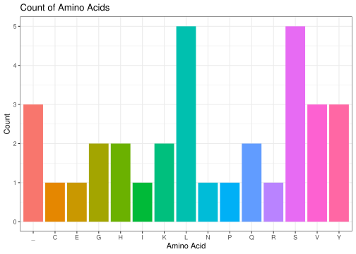

<!-- README.md is generated from README.Rmd. Please edit that file -->

# cdogma

<!-- badges: start -->
<!-- badges: end -->

``` r
library(cdogma)
```

The cdogma package helps you convert your DNA sequence into a protein,
replicating the central dogma in biology. It can also be used to
simulate a DNA strand of x length for training purposes. Finally, it can
provide you with a great visualization of the amino acid composition
encoded in the input DNA sequence.

***Typical use case:***

Step 0 Generate random DNA sequence with set length (optional)

``` r
DNA <- create_string(size=100)
```

Step 1 Convert the DNA (coding strand) input to mRNA

``` r
mRNA <- dna_to_rna(DNA)
```

Step 2 Convert the mRNA to a vector of codons

``` r
# load the codon translation table
load("~/cdogma/R/sysdata.rda")
vector_of_codons <- rna_to_codons(mRNA)
```

Step 3 Convert the vector of codons to a protein sequence

``` r
protein <- translate(vector_of_codons)
```

Step 4 Visualize the amino acid distribution in the protein

``` r
bar_chart <- count_aa(protein)
bar_chart
```


